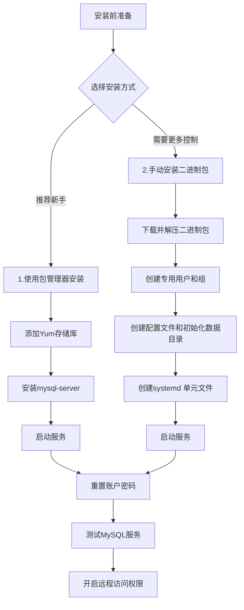

# 安装 MySQL

> 注：以下 Linux 服务器为 CentOS 7+、MySQL 版本为 8.0+

## 一、流程图



## 二、安装前的准备工作

在开始安装之前，建议你先完成以下步骤：

更新系统软件包： 更新系统，确保所有软件包都是最新状态。（对于启用 dnf 的系统，请在命令中将  **yum**  替换为  **dnf**）

```bash
yum update
```

检查是否已安装 MySQL：执行以下命令检查

```bash
yum list installed | grep mysql
yum list installed | grep mariadb
```

卸载：如果存在旧版本，建议卸载以避免冲突。

```bash
yum remove 包名
```

清理残留文件：卸载后建议删除相关配置文件和数据目录。

```bash
# 删除配置文件
rm -rf /etc/my.cnf

# 删除数据目录（注意：会删除所有数据）
rm -rf /var/lib/mysql

# 删除日志文件
rm -rf /var/log/localhost.log
```

## 三、使用包管理器安装（简单，易管理）

### 1. **添加 MySQL Yum 存储库**

从 MySQL Yum 存储库页面 (https://dev.mysqlserver.cn/downloads/repo/yum/)（在 MySQL 开发者专区）下载它。上传到服务器后执行（对于启用 dnf 的系统，请在命令中将  **yum**  替换为  **dnf**）

```bash
yum localinstall mysql84-community-release-el9-1.noarch.rpm
```

您可以通过以下命令检查 MySQL Yum 存储库是否已成功添加并启用

```bash
yum repolist enabled | grep mysql.*-community
```

### **2. 禁用默认的 MySQL 模块**

(仅限 EL8 系统) 基于 EL8 的系统（例如 RHEL8 和 Oracle Linux 8）包含一个默认情况下启用的 MySQL 模块。

```bash
yum module disable mysql
```

### **3. 安装 MySQL**

通过以下命令安装 MySQL

```bash
yum install mysql-community-server
```

这将安装 MySQL 服务器软件包 (`mysql-community-server`)，以及运行服务器所需组件的软件包，包括客户端软件包 (`mysql-community-client`)、客户端和服务器的通用错误消息和字符集 (`mysql-community-common`) 以及共享客户端库 (`mysql-community-libs`)。

### 4. 启动 MySQL 服务器

使用以下命令启动 MySQL 服务器。

```bash
systemctl start mysqld
```

您可以使用以下命令检查 MySQL 服务器的状态。

```bash
systemctl status mysqld
```

如果操作系统启用了 systemd，则应使用标准的  **systemctl**（或者，使用参数反转的  **service**）命令，例如  **stop**、**start**、**status**  和  [**restart**](https://dev.mysqlserver.cn/doc/refman/9.0/en/restart.html)  来管理 MySQL 服务器服务。 `mysqld`  服务默认情况下处于启用状态，并且在系统重启时启动。

## 四、手动安装二进制包（难，但更灵活）

### **1. MySQL Linux 通用二进制分发目录**

| **目录**        | **目录内容**                                                                                     |
| --------------- | ------------------------------------------------------------------------------------------------ |
| `bin`           | [**mysqld**](https://dev.mysqlserver.cn/doc/refman/9.0/en/mysqld.html)  服务器、客户端和实用程序 |
| `docs`          | Info 格式的 MySQL 手册                                                                           |
| `man`           | Unix 手册页                                                                                      |
| `include`       | 包含（头）文件                                                                                   |
| `lib`           | 库                                                                                               |
| `share`         | 错误消息、字典和用于数据库安装的 SQL                                                             |
| `support-files` | 各种支持文件                                                                                     |

### **2. 命令序列如下所示**

```bash
yum install libaio
tar -xvf /path/to/mysql-VERSION-OS.tar.xz
ln -s full-path-to-mysql-VERSION-OS mysql
groupadd mysql
useradd -r -g mysql -s /bin/false mysql
cd /etc
touch my.cnf
chown root:root my.cnf
cd /usr/local/mysql
mkdir data
chmod 750 data
chown mysql:mysql data
bin/mysqld --defaults-file=/etc/my.cnf --initialize
cat data/localhost.localdomain.err
cd /usr/lib/systemd/system
touch mysqld.service
systemctl enable mysqld.service
systemctl start mysqld
```

### 3. 安装二进制包

**安装 libaio 库**：MySQL 依赖于该`libaio`  库。如果未在本地安装此库，则数据目录初始化和后续服务器启动步骤将失败。如有必要，请使用适当的包管理器安装它。例如，在基于 Yum 的系统上：

```bash
yum search libaio  # search for info
yum install libaio # install library
```

**下载和解压**：从 MySQL 官网[下载](https://downloads.mysql.com/archives/community/)对应版本的二进制压缩包（如 mysql-9.4.0-linux-glibc2.28-x86_64.tar.xz），使用 `tar -xzf` 命令解压。

```bash
tar xvf mysql-9.4.0-linux-glibc2.28-x86_64.tar.xz -C /usr/local/
cd /usr/local/

mv mysql-9.4.0-linux-glibc2.28-x86_64 mysql
#或
ln -s mysql-9.4.0-linux-glibc2.28-x86_64 mysql
```

**创建专用用户和组**：创建一个不允许登录系统的 MySQL 专用用户，提升安全性。

```bash
groupadd mysql
useradd -r -g mysql -s /bin/false mysql
#或
useradd -r -g mysql -s /usr/sbin/nologin mysql
```

`-s` 设置用户的登录 shell

`/bin/false` 一个总是返回失败的程序，这样设置后，该用户**无法通过 shell 登录系统**

`/usr/sbin/nologin` 达到类似效果，并给出友好提示

### 4. 安装后配置

**配置环境变量**：将 mysql 加入环境变量中。

```bash
vim /etc/profile.d/mysql.sh
```

```bash
#编辑mysql.sh内容
export MYSQL_HOME=/usr/local/mysql
export PATH=$MYSQL_HOME/bin:$PATH
```

```bash
source /etc/profile.d/mysql.sh
```

**创建配置文件**：通过将它们放在 MySQL 配置文件中来指定 MySQL 服务器在启动时应使用的选项。如果不这样做，服务器将以其默认设置启动，要创建 MySQL 配置文件，请以 root 身份发出以下命令：

```bash
cd /etc
vim my.cnf
```

添加以下设置到配置文件中

```bash
[client]
socket=/usr/local/mysql/data/mysql.sock

[mysqld]
datadir=/usr/local/mysql/data
socket=/usr/local/mysql/data/mysql.sock
port=3306
log-error=/usr/local/mysql/data/localhost.log
user=mysql
secure_file_priv=NULL
local_infile=OFF
```

**初始化数据目录**：进入 MySQL 目录并初始化数据目录

```bash
cd /usr/local/mysql
mkdir data
chmod 750 data
chown mysql:mysql data
bin/mysqld --defaults-file=/etc/my.cnf --initialize
```

初始化输出被打印到日志 ( `/usr/local/mysql/data/localhost.log`) 中。

### **5. 使用 systemd 启动服务器**

添加一个 systemd 服务单元配置文件

```bash
cd /usr/lib/systemd/system
vim mysqld.service
```

将此配置信息添加到 mysqld.service 文件中：

```bash
[Unit]
Description=MySQL Server
Documentation=man:mysqld(8)
Documentation=http://dev.mysql.com/doc/refman/en/using-systemd.html
After=network.target
After=syslog.target

[Install]
WantedBy=multi-user.target

[Service]
User=mysql
Group=mysql

# Have mysqld write its state to the systemd notify socket
Type=notify

# Disable service start and stop timeout logic of systemd for mysqld service.
TimeoutSec=0

# Start main service
ExecStart=/usr/local/mysql/bin/mysqld --defaults-file=/etc/my.cnf $MYSQLD_OPTS

# Use this to switch malloc implementation
EnvironmentFile=-/etc/sysconfig/mysql

# Sets open_files_limit
LimitNOFILE = 10000

#Restart=on-failure

#RestartPreventExitStatus=1

# Set environment variable MYSQLD_PARENT_PID. This is required for restart.
#Environment=MYSQLD_PARENT_PID=1

#PrivateTmp=false
```

使用以下命令来管理 MySQL 服务。

```bash
#使mysqld服务在重新启动时自动启动。
systemctl enable mysqld.service

#手动启动mysqld服务
systemctl start mysqld

#检查mysqld服务的状态
systemctl status mysqld
```

## 五、重置 MySQL root 账户密码

使用客户端，使用服务器在初始化序列期间生成的随机密码  `mysql`连接到服务器：`root@localhost`

```bash
# Yum 安装
grep 'temporary password' /var/log/mysqld.log
# 二进制安装
grep 'temporary password' /usr/local/mysql/data/*.err

mysql -u root -p
```

```sql
mysql> ALTER USER 'root'@'localhost' IDENTIFIED BY 'password';
mysql> exit
```

>💡 提示：如果启用了 validate_password 插件（默认开启），密码必须满足强度策略（大写、小写、数字、特殊字符、长度 ≥ 8）。

## 六、测试 MySQL 服务器

使用**mysqlshow**验证您是否可以从服务器检索信息。

```bash
mysqlshow -u root -p
```

使用**mysqladmin**查看 MySQL 服务器版本信息。

```bash
mysqladmin -u root -p version
```

## 七、开启远程访问权限

需要登录到 MySQL 服务器，执行下面的命令：

```sql
-- 1. 创建用户
CREATE USER 'username'@'%' IDENTIFIED BY 'password';

-- 2. 授权
GRANT ALL PRIVILEGES ON *.* TO 'username'@'%';

-- 3.刷新权限
FLUSH PRIVILEGES;
```

这里的 `username` 和 `password` 分别是远程用户的用户名和密码，`%` 表示允许任何 IP 地址的用户连接。如果需要限制特定 IP 地址，可以将 `%` 替换为具体的 IP 地址。

编辑 MySQL 的配置文件 `my.cnf` ， 允许任意 IP 地址访问：

```bash
[mysqld]
# 注释掉或删除这一行（如果存在）：
# 如果不想暴露MySQL，可以保留，通过SSH 隧道（端口转发）安全地连接，具体见常见问题
# bind-address = 127.0.0.1

# 或显式绑定到所有地址：
bind-address = 0.0.0.0
```

修改后，保存文件并重启 MySQL 服务以使更改生效：

```bash
systemctl restart mysqld
```

在客户端计算机上，使用以下命令尝试连接到远程 MySQL 服务器：

```bash
mysql -h server_ip -P 3306 -u username -p

#例如
mysql -h192.168.100.128 -P3306 -uroot -p123456
```

## 八、常见问题

### **1. MySQL 服务无法启动**

可以运行 `systemctl status mysql` 查看服务状态，或者通过 `journalctl -xe` 查看系统日志来排查问题。

### **2. SELinux 或 AppArmor 阻止执行**

临时禁用 SELinux 测试：

```bash
setenforce 0
systemctl start mysqld
```

如果成功，说明是 SELinux 策略问题。可恢复后添加策略：

```bash
setenforce 1
restorecon -R /usr/local/mysql
# 或使用 audit2allow 生成自定义策略
```

### **3. 客户端连接失败**：

**检查防火墙设置**：确保服务器的防火墙开放了 MySQL 的默认 3306 端口。可以使用以下命令。

```bash
firewall-cmd --list-ports | grep 3306
```

如果没有放行（输出是空的），执行以下命令，重新检查

```bash
firewall-cmd --permanent --add-port=3306/tcp
firewall-cmd --reload
```

**检查 MySQL 绑定地址**：查看 MySQL 配置文件（如 `/etc/mysql/my.cnf`）中的 `bind-address` 选项。如果希望从其他机器连接，需将其设置为服务器的 IP 地址或 `0.0.0.0`（注意安全风险），或者直接注释掉该行。

如果服务端只允许本机访问（127.0.0.1），则在客户端执行下面的命令：

```bash
ssh -L 3307:127.0.0.1:3306 user@your-server.com
#或
ssh -fNL 3307:127.0.0.1:3306 user@your-server.com

mysql -h 127.0.0.1 -P 3307 -u myuser -p
```

`-L 3307:127.0.0.1:3306`：表示将本地机器的  **3307 端口**  转发到远程服务器上的  `127.0.0.1:3306` 。

`user@your-server.com`：是你在远程服务器上的登录账户和主机地址。

`-fNL` ：在后台运行，不执行远程命令，同时设置本地端口转发。

如果是后台运行，Linux/MacOS 用 `ps aux | grep ssh` ，Windows 用 `get-process ssh*` ，找到进程并 `kill <PID>` 。

### **4. 忘记 root 密码**：

1. 停止 MySQL 服务。
2. 在配置文件中（如 `[mysqld]` 段下）添加 `skip-grant-tables`。
3. 重启 MySQL 服务，此时可以不需密码登录。
4. 执行 `FLUSH PRIVILEGES;` 后重设 root 密码。
5. 移除 `skip-grant-tables` 配置，重启 MySQL 服务。

参考：

[MySQL :: MySQL 9.0 参考手册 :: 2.5.1 使用 MySQL Yum 存储库在 Linux 上安装 MySQL - MySQL 数据库](https://dev.mysqlserver.cn/doc/refman/9.0/en/linux-installation-yum-repo.html)

[MySQL :: MySQL 9.0 参考手册 :: 2.2 在 Unix/Linux 上使用通用二进制文件安装 MySQL - MySQL 数据库](https://dev.mysqlserver.cn/doc/refman/9.0/en/binary-installation.html)

[第 5 章安装后设置\_MySQL 8.0 安全部署指南](https://mysql.net.cn/doc/mysql-secure-deployment-guide/8.0/en/secure-deployment-post-install.html)
